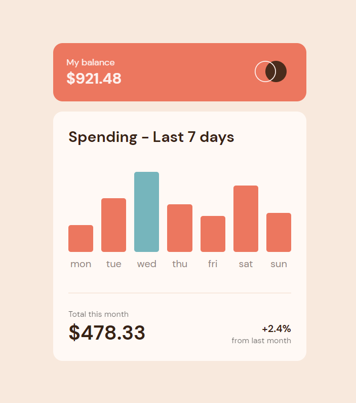

### The challenge

Users should be able to:

- [x] View the bar chart and hover over the individual bars to see the correct amounts for each day
- [x] See the current day’s bar highlighted in a different colour to the other bars
- [x] View the optimal layout for the content depending on their device’s screen size
- [x] See hover states for all interactive elements on the page
- [x] **Bonus**: Use the JSON data file provided to dynamically size the bars on the chart

### Links

- Solution URL: [Solution](https://www.frontendmentor.io/solutions/expenses-chart-component-1zxl45HNH_)
- Live Site URL: [LIVE](https://expenses-chart-card.netlify.app/)

### Built with

- HTML5 
- CSS 
- JAVASCRIPT

### Continued development

Organizing javascript code

## Author

- Frontend Mentor - [Abrosss](https://www.frontendmentor.io/profile/Abrosss)
- [Twitter](https://twitter.com/ronessu)

